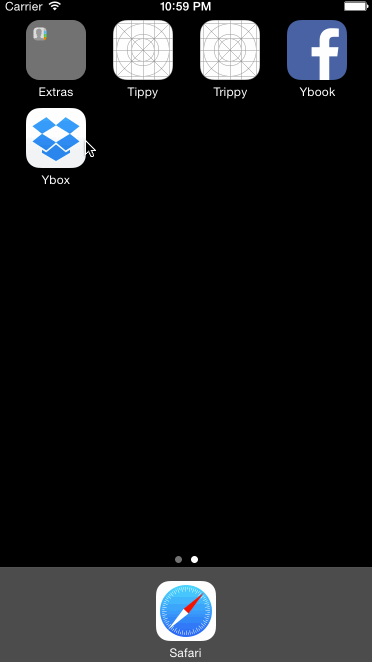

# Ybox

Prototype of a Dropbox app.  Spent about 3 hours on it.  I didn't make any of the views scrollable as I'd done a bunch of those in the Facebook exercise and started to investigate how to create a reusable class that would automatically make its image child scrollable.  I've poked around but haven't been able to find anything that would do this, which is surprising.  

